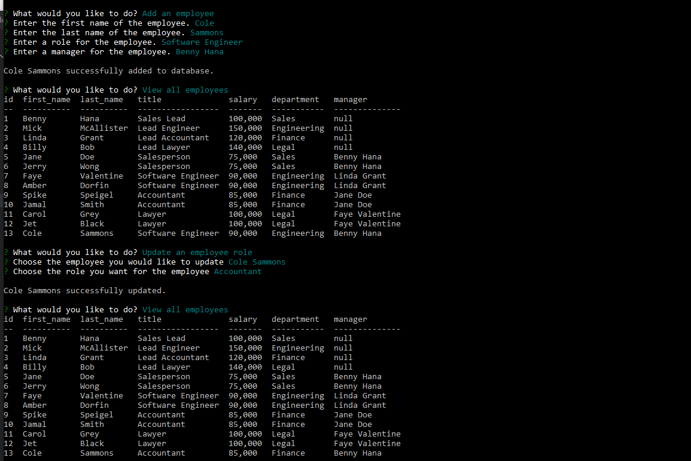

# Note Taker

  

  ## Description 

  Easily track departments, roles, and employees. Salary and managers are included as well.
  
  ## Table of Contents

  * [Installation](#installation)
  * [Usage](#usage)
  * [Technologies](#technologies)
  * [Credits](#credits)
  * [License](#license)
  * [Contributing](#contributing)
  * [Tests](#tests)
  * [Questions](#questions)
   
  ## Installation
  
  Simply download or clone into a directory. Node is a prerequisite along with inquirer, mysql2, and console.table. Once node is installed and initialized ('npm init') run 'npm install mysql2 inquirer console.table'. To launch the server run 'node server'.
  
  ## Usage

  Organizes a databse of employees for easy tracking
  
  
  
  [Link to user flow video](https://drive.google.com/file/d/1bCuzMGnWr4KnDaZMtkEyRP7JayzEfNQZ/view)
  

  ## Technologies
  
  * Javascript
  * Node
  * mysql
  * inquirer
  * console.table

  ## Credits

  Cole Sammons

  
  ## License
  [MIT License](https://opensource.org/licenses/MIT)

  Copyright &copy; 2021
  

  ## Contributing

  No contributions at the moment

  ## Tests

  No tests currently.

  ## Questions

  Contact through email for any inquiries.

  colemsammons@gmail.com

  [Github repo](https://github.com/ColeSammons/employee-tracker)
